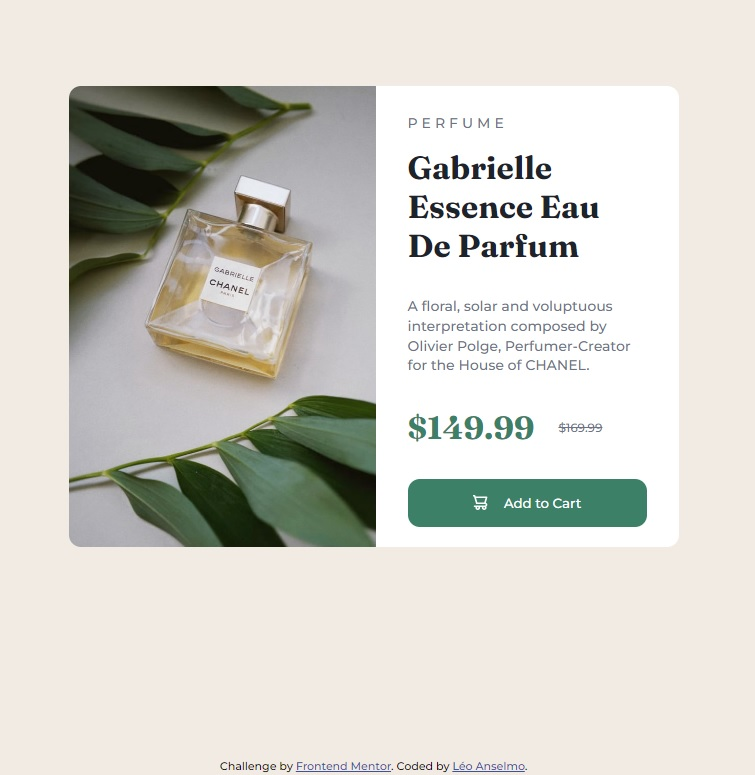

# Frontend Mentor - solução do projeto Product preview card component solution


Esta é uma solução para o [desafio do Product preview card component no Frontend Mentor.](https://www.frontendmentor.io/challenges/product-preview-card-component-GO7UmttRfa) Os desafios do Frontend Mentor ajudam você a melhorar suas habilidades de codificação criando projetos realistas.

## Índice

- [Visão geral](#visão-geral)
  - [Screenshot](#screenshot)
  - [Links](#links)
- [Meu processo](#meu-processo)
  - [Desenvolvido com](#desenvolvido-com)
  - [Como desenvolvi](#como-desenvolvi)
  - [Desenvolvimento contínuo](#desenvolvimento-contínuo)  
- [Autor](#autor)
- [Agradecimentos](#agradecimentos)

## Visão geral

### Screenshot



### Links

- [URL da solução no Git](https://github.com/leonardoanselmo/product-preview-card-component-main)
- [URL do site](https://product-preview-card-component-main-six-flame.vercel.app/)

## Meu processo

### Desenvolvido com

- HTML5 semântico
- CSS3 propriedades customizadas
- Flexbox

### Como desenvolvi

Antes de começar colocando a mão no código resolvi estruturar dessa vez o **HTML** e só depois ir para o **style.css** resetando as margens e padding, escolhendo o FLEXBOX, mesmo se tratando de um card com 2 colunas, assim ficaria mais fácil estilizado quando fosse pra o layout mobile, pois o FLEXBOX já tem isso no seu DNA.Os elementos abaixo ficaram todos centralizados e as cores que seriam usadas no projeto em variáveis. Como eu estava trabalhando com 2 tipos de fontes achei melhor usa-las quando fosse necessário, assim eu poderia escolher qual seria em cada área do site.

```css
* {
  margin: 0;
  padding: 0;
  box-sizing: border-box;  
}
```

OBS: Criei uma ``<div>`` principal e estruturei as demais dentro. Esse exemplo eu acabei aprendendo no [FEDMentor.dev](https://fedmentor.dev/posts/html-plan-product-preview/). Me ajudou bastante, principalmente a troca das imagens, dependendo da resolução de tela do despositivo, sem precisar fazer várias chamadas ao CSS ou ocultando código.
```html
<div class="c-product-card">
  <div class="c-product-card__img-half">        
  </div>

  <div class="c-product-card__text-half">        
  </div>
</div>  
```
O CSS eu resolvi deixar a estrutura de centralizado e alinhado no body, assim eu me concentrava somente naquela área.

```css
body {
  position: relative;
  background-color: var(--cream);
  margin: 0 auto;
  max-width: 1440px;
  height: 100vh;
  display: flex;
  justify-content: center;
  align-items: center;    
  font-family: 'Montserrat', sans-serif;
}
```

Ainda acho complicado conseguir identificar as cores para o projeto, pois não é disponibilizado o arquivo do FIGMA e muitas das vezes o conta gotas não pega as porcentagens corretas referente a cor. Mas, entendo que precisa ser membro para ter direitos sobre esse detalhe.
```css
:root {
  --dark-cyan: hsl(158, 36%, 37%);
  --cream: hsl(30, 38%, 92%);

  --very-dark-blue: hsl(212, 21%, 14%);
  --dark-grayish-blue: hsl(228, 12%, 48%);
  --white: hsl(0, 0%, 100%);
}
```

No HTML escolhi a TAG semântica ``<main></main>`` e ``<footer></footer> `` por saber que é um card isolado e precisava de uma marcação principal para o conteúdo e outra para o footer(rodapé).

Todas as tags incluindo ````, ``<H2>`` e ``<span>`` foram acrescentadas classes CSS baseado na metodologia BEM.

```html
<hgroup class="c-product-card__title-group">
  <span class="c-product-card__ribbon">Perfume</span>
  <h2 class="c-product-card__title">Gabrielle Essence Eau De Parfum</h2>
</hgroup>   
```

### Desenvolvimento contínuo

Essa foi minha terceira experiência com o modelo do [Frontend Mentor](https://www.frontendmentor.io/challenges/product-preview-card-component-GO7UmttRfa/hub), com isso já estou começando a criar um padrão de como começar um projeto, estruturando primeiro o HTML e depois o CSS. 

## Autor

- Website - [Léo Ansélmo](https://github.com/leonardoanselmo)
- Frontend Mentor - [@leonardoanselmo](https://www.frontendmentor.io/profile/leonardoanselmo)
- Twitter - [@barblo](https://twitter.com/barblo)

## Agradecimentos

Agradeço a toda equipe do [Frontend Mentor](https://www.frontendmentor.io) por proporcionar um modelo de práticas em desenvolvimento como esse. Logo estarei postando mais projetos aqui! 🚀
